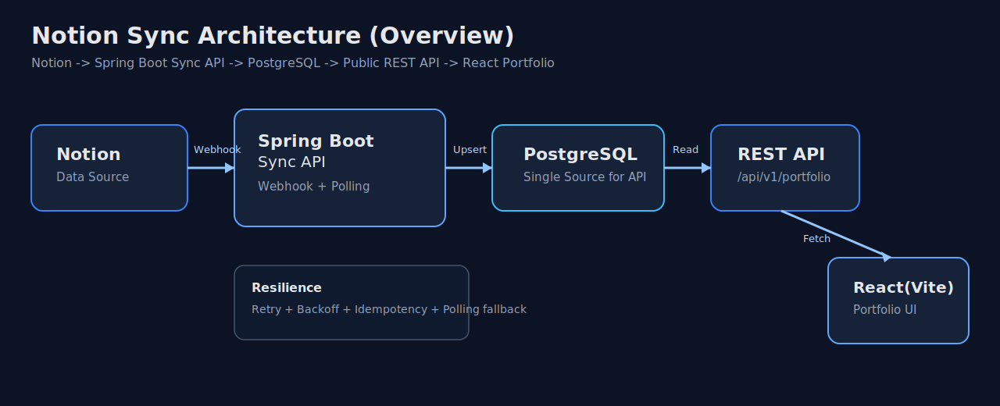
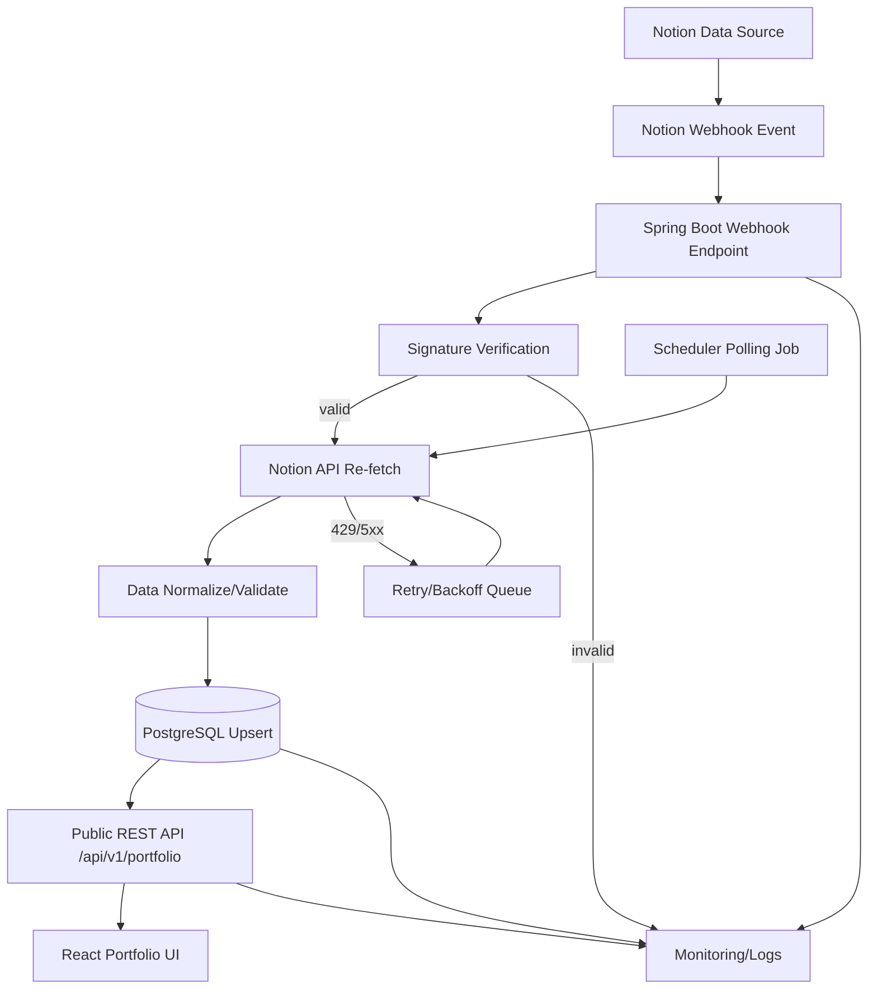

# Notion Sync Architecture Guide

## 0. 이슈 #11 정합성
### 0.1 목표
- Notion에서 수정한 포트폴리오 데이터가 배포된 프론트에 안정적으로 반영되도록 전체 아키텍처를 확정한다.

### 0.2 작업 항목 매핑
- 데이터 흐름: `Notion -> Spring Boot -> PostgreSQL -> React`
- 백엔드 스택: `Spring Boot + PostgreSQL + REST API`
- 동기화 전략: `Webhook 우선 + Polling 백업`
- 운영 기준: 보안/재시도/로깅/환경 분리(dev/stage/prod)

### 0.3 완료 조건
- 아키텍처/동기화 정책 문서가 저장소에 정리되어야 한다.
- 후속 구현 이슈(`#12`, `#13`, `#14`)의 선행 의사결정이 종료되어야 한다.

## 1. 문서 목적
- 이 문서는 이슈 `#11`의 아키텍처 결정을 실행 가능한 수준으로 정리한 문서다.
- 범위는 `Notion -> Spring Boot -> PostgreSQL -> REST -> React` 데이터 흐름이다.
- 프론트는 기존 TypeScript React(Vite)를 유지한다.

## 2. 아키텍처 개요 (A: 요약)


### 2.1 핵심 원칙
- Notion은 원천 콘텐츠 소스(Source of Truth)로 사용한다.
- 프론트는 Notion을 직접 호출하지 않고, 항상 백엔드 REST API만 호출한다.
- 백엔드는 Webhook 기반 실시간 동기화 + Polling 기반 누락 보정(2중 안전장치)을 사용한다.

### 2.2 구성 요소
- Notion Data Source: 포트폴리오 원본 데이터 관리
- Spring Boot Sync API: 동기화/검증/정규화/저장 담당
- PostgreSQL: API 제공 기준 저장소
- Public REST API: 프론트 조회 전용 인터페이스
- React(Vite) Frontend: 렌더링/로딩/에러 처리

### 2.3 기술 결정(Decision)
- 백엔드 프레임워크: Spring Boot
  - 권장 기준: `3.5.x`(현재 안정성과 생태계 호환성 우선)
  - 검토 옵션: `4.x`(신규 프로젝트 최신성 우선 시)
- DBMS: PostgreSQL
- API 스타일: REST(JSON)
- 프론트: React + TypeScript + Vite(기존 유지)

## 3. 상세 플로우 (B: 운영 포함)


## 4. 동기화 절차
1. Notion에서 페이지/데이터소스가 변경되면 Webhook 이벤트가 발생한다.
2. Spring Boot가 이벤트를 수신하고 서명을 검증한다.
3. 이벤트 payload를 그대로 저장하지 않고, Notion API에서 최신 데이터를 재조회한다.
4. 검증/정규화 후 PostgreSQL에 upsert한다.
5. 프론트는 `GET /api/v1/portfolio` 재호출 시 최신 데이터를 렌더링한다.

## 5. 실패/복구 전략
- Webhook 누락 대비: 주기 Polling(예: 5분)으로 `last_edited_time` 기반 보정
- API 제한/오류: exponential backoff 재시도
- 중복 이벤트: idempotency key로 중복 반영 방지
- 장애 분석: 요청 ID, 이벤트 ID, 처리 결과를 구조화 로그로 저장

## 6. API 가이드 (초안)
### 6.1 조회 API
- `GET /api/v1/portfolio`

### 6.2 응답 예시(요약)
```json
{
  "profile": {},
  "skills": [],
  "projects": [],
  "experience": [],
  "contact": {},
  "meta": {
    "syncedAt": "2026-02-23T00:00:00Z",
    "source": "notion"
  }
}
```

## 7. 보안 기준
- Notion API 토큰은 서버 환경변수/시크릿 매니저에만 저장한다.
- 프론트 코드/저장소에 토큰을 포함하지 않는다.
- Webhook 서명 검증 실패 요청은 즉시 차단한다.
- API 입력 검증 및 표준 에러 포맷을 적용한다.

## 7.1 환경 분리 기준
- `dev`: 기능 개발/연동 검증용 환경
- `stage`: 운영과 동일한 설정으로 배포 전 검증
- `prod`: 사용자 트래픽 처리, 최소 권한/감사 로그 적용

## 8. 우선순위
- 본 아키텍처 작업은 기존 오픈 이슈 `#6`, `#7`보다 우선(P0)로 진행한다.
- 후속 구현 순서: `#12 -> #13 -> #14`

## 9. 체크리스트
- [ ] 아키텍처 합의 완료
- [ ] DB 스키마/마이그레이션 설계 완료
- [ ] Webhook + Polling 동기화 구현 완료
- [ ] 프론트 API 전환 완료
- [ ] 운영 로그/알람 기준 반영 완료
